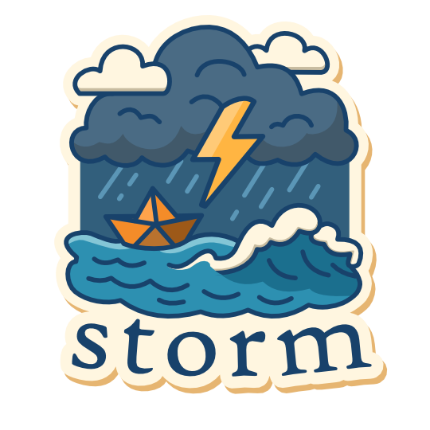

    

# Storm

Storm is a Go-based scenario-driven testing framework that executes complex,
sequential end-to-end tests as standalone binaries, specifically designed for
infrastructure validation and multi-stage deployment testing.

## Contents

- [Storm](#storm)
  - [Contents](#contents)
  - [Concepts](#concepts)
  - [How do I use it?](#how-do-i-use-it)
  - [Hello World Example](#hello-world-example)
  - [What Are All These Folders?](#what-are-all-these-folders)
  - [Contributing](#contributing)
  - [Trademarks](#trademarks)

## Concepts

- **Suite**: A suite is a collection of scenarios and helpers. It is the main
  entry point for a storm-based binary.

- **Scenario**: A scenario is a large collection of sequential tests. These will
  generally cover end-to-end testing for a specific feature or component. It may
  also include setup and cleanup logic.

- **Helper**: A helper is a small(er) piece of code that may be invoked
  individually. Their main function is to provide an easy way to write Go-based
  test code as opposed to Python or Bash.

A helper may include a set of tests, but it is not required.

## How do I use it?

See [USAGE.md](USAGE.md) for detailed instructions on how to create
suites, scenarios, and helpers.

## Hello World Example

See the `helloworld` suite for a simple example of how to use Storm.

- [Entry point](samples/helloworld/cmd/storm-helloworld/main.go)
- [Scenario](samples/helloworld/testsuite/scenario.go)
- [Helper](samples/helloworld/testsuite/helper.go)

## What Are All These Folders?

- `pkg/storm`: Contains the public storm library.
- `internal`: Contains logic internal to the storm library.
- `samples`: Contains example test suites.

## Contributing

This project welcomes contributions and suggestions. Most contributions require
you to agree to a Contributor License Agreement (CLA) declaring that you have
the right to, and actually do, grant us the rights to use your contribution. For
details, visit
[Contributor License Agreements](https://cla.opensource.microsoft.com).

When you submit a pull request, a CLA bot will automatically determine whether
you need to provide a CLA and decorate the PR appropriately (e.g., status check,
comment). Simply follow the instructions provided by the bot. You will only need
to do this once across all repos using our CLA.

This project has adopted the
[Microsoft Open Source Code of Conduct](https://opensource.microsoft.com/codeofconduct/).
For more information see the
[Code of Conduct FAQ](https://opensource.microsoft.com/codeofconduct/faq/) or
contact [opencode@microsoft.com](mailto:opencode@microsoft.com) with any
additional questions or comments.

## Trademarks

This project may contain trademarks or logos for projects, products, or
services. Authorized use of Microsoft trademarks or logos is subject to and must
follow
[Microsoft's Trademark & Brand Guidelines](https://www.microsoft.com/legal/intellectualproperty/trademarks/usage/general).
Use of Microsoft trademarks or logos in modified versions of this project must
not cause confusion or imply Microsoft sponsorship. Any use of third-party
trademarks or logos are subject to those third-party's policies.
